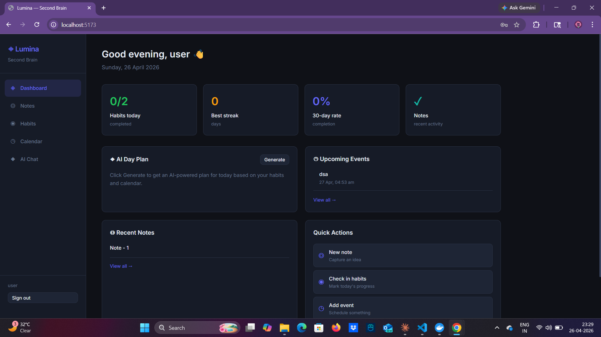
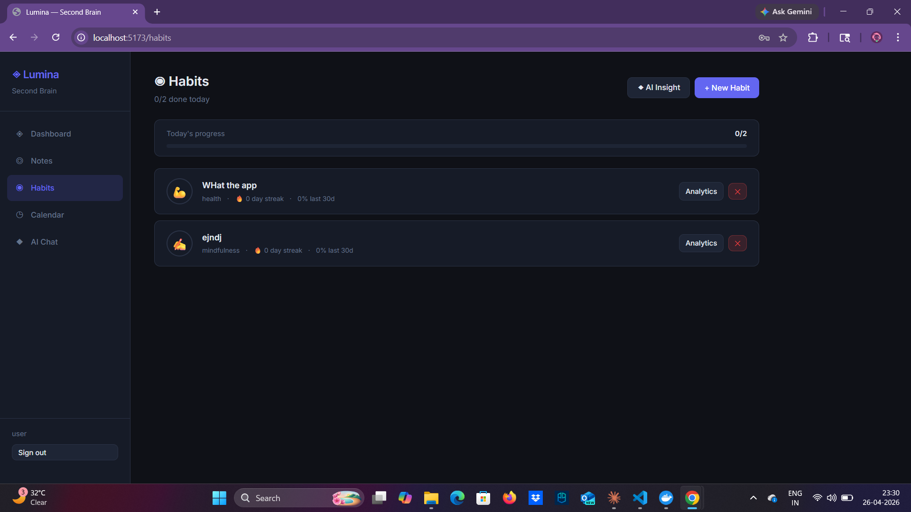
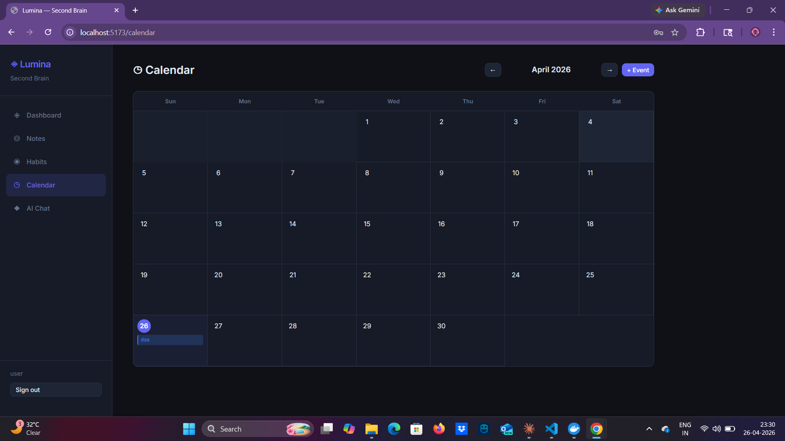

# Lumina — AI-Powered Second Brain


A full-stack productivity app combining **notes with AI summarisation**, **habit tracking with analytics**, **calendar with reminders**, and an **AI assistant** that knows your entire context.

## 🎯 What's New in v2.0

### 🎨 Complete Frontend Redesign
- **Modern design system** with sophisticated color palette and typography
- **Responsive layouts** that work beautifully on all screen sizes
- **Smooth animations** and micro-interactions throughout
- **Enhanced user experience** with improved visual hierarchy
- **Production-grade UI** that avoids generic aesthetics

### 🚀 Enhanced Features
- **Improved Dashboard** with modern stat cards and quick actions
- **Better Notes editor** with enhanced AI integration
- **Streamlined Habits tracking** with visual progress indicators
- **Modern Calendar interface** with improved event management
- **Enhanced AI Chat** with better conversation experience
- **Comprehensive Reminders** system with modern management UI

---

## ✨ Features

### 📝 Smart Notes
- **Markdown editor** with folder organization
- **AI-powered summarisation** — one click → 2-3 sentence summary
- **AI tag suggestions** — automatic tag recommendations
- **Full-text search** across title, content, and tags
- **Note templates** — create reusable templates with categories
- **Pin, archive, and favorite** for better organization

### ✅ Habit Tracking
- **Daily check-in** with streak tracking
- **GitHub-style contribution heatmap** (full year view)
- **Weekly bar charts** with target vs. completed
- **Completion rate trends** (7d / 30d / 90d)
- **AI weekly insight reports** with coaching tips
- **Customizable habits** with colors, icons, and categories

### 📅 Calendar & Events
- **Month-view calendar** with color-coded events
- **Create/edit/delete events** with date-time picker
- **Link events to notes** for context
- **Upcoming events widget** on dashboard
- **Smart reminders** for events and habits

### 🔔 Intelligent Reminders
- **Email notifications** for events, habits, and custom reminders
- **Customizable timing** — 15min, 30min, 1h, 2h, 24h, 3d before
- **User preferences** — control what types of reminders you receive
- **Quiet hours** — no notifications during specific times
- **Reminder history** — track all sent reminders

### 🤖 AI Assistant
- **Context-aware chat** powered by Claude
- **Knows your notes, habits, and calendar**
- **Day planner** — generates personalized schedules
- **Habit coaching** via AI reports
- **Smart suggestions** based on your data

---

## 🚀 Quick Start

### Prerequisites
- Docker & Docker Compose
- Anthropic API key (get one at https://console.anthropic.com)

### 1. Clone and Configure

```bash
git clone https://github.com/Abhinav-143x/lumina.git
cd lumina
cp .env.example .env
```

Edit `.env` and add your credentials:
```env
SECRET_KEY=your-random-secret-key
ANTHROPIC_API_KEY=sk-ant-your-key-here
EMAIL_HOST_USER=your-email@gmail.com
EMAIL_HOST_PASSWORD=your-app-password
```

### 2. Start All Services

```bash
docker compose up --build
```

This starts 6 services: `api`, `worker`, `beat`, `db`, `redis`, `frontend`

### 3. Setup Database

```bash
docker compose exec api python manage.py migrate
docker compose exec api python manage.py createsuperuser
```

### 4. Open the App

| URL | Description |
|-----|-------------|
| `http://localhost:5174` | React frontend |
| `http://localhost:8000/api/docs/` | API documentation |
| `http://localhost:8000/admin/` | Django admin |

---

## 📖 Usage Guide

### Taking Notes
1. Navigate to **Notes** from the sidebar
2. Click **New Note** to create a note
3. Write in Markdown — use headers, lists, code blocks
4. Click **✨ Summarise** for AI-powered summary
5. Click **🏷️ Suggest Tags** for automatic tag suggestions
6. Organize with folders and pin important notes

### Tracking Habits
1. Go to **Habits** and click **New Habit**
2. Set name, description, color, and frequency
3. Check in daily to build your streak
4. View analytics with heatmaps and completion rates
5. Get AI coaching insights weekly

### Managing Calendar
1. Navigate to **Calendar** for month view
2. Click any day to add an event
3. Set title, time, description, and color
4. Events automatically create reminders
5. View upcoming events on dashboard

### Setting Reminders
1. Go to **Reminders** in the sidebar
2. Click **New Reminder** for custom reminders
3. Choose type: event, habit, or custom
4. Set timing (15min to 3 days before)
5. Configure preferences in **Settings**
6. Enable/disable email notifications by type

### Using Templates
1. In Notes, access **Templates** from the menu
2. Browse system and custom templates
3. Click **Use** to create a note from a template
4. Create your own templates for repeated note types
5. Favorite frequently used templates

### AI Assistant
1. Navigate to **AI Chat** for intelligent help
2. Ask questions about your notes, habits, or schedule
3. Request day planning: "Plan my day for tomorrow"
4. Get habit coaching and productivity tips
5. Use suggested starters for quick access

---

## 🎯 Tips & Tricks

### Productivity
- **Use templates** for meeting notes, daily journals, project plans
- **Link events to notes** for context and follow-ups
- **Set habit reminders** to maintain consistency
- **Pin important notes** for quick access
- **Use folders** to organize by project or topic

### AI Features
- **Summarise long notes** before meetings
- **Get tag suggestions** to improve organization
- **Ask AI to plan your day** based on calendar and habits
- **Request weekly habit insights** for motivation
- **Use AI chat** to search and understand your data

### Analytics
- **Check habit heatmaps** to visualize consistency
- **Monitor completion rates** for 7/30/90 day trends
- **Review streak history** to stay motivated
- **Compare habit performance** over time

---

## 🔧 Configuration

### Email Setup
For email reminders to work, configure these in `.env`:
```env
EMAIL_BACKEND=django.core.mail.backends.smtp.EmailBackend
EMAIL_HOST=smtp.gmail.com
EMAIL_PORT=587
EMAIL_USE_TLS=True
EMAIL_HOST_USER=your-email@gmail.com
EMAIL_HOST_PASSWORD=your-app-password
```

### AI Model
Change the AI model in `.env`:
```env
AI_MODEL=claude-haiku-4-5-20251001  # Fast, cost-effective
# or
AI_MODEL=claude-sonnet-4-6-20250514  # Higher quality
```

### Notification Preferences
Access via **Reminders → Preferences**:
- Enable/disable email notifications
- Control event, habit, and custom reminders
- Set default timing for each type
- Configure quiet hours

---

## 🏗️ Architecture

```
Browser (React + Vite)
        │  REST API
        ▼
Django 4.2 + DRF ──► PostgreSQL (notes, habits, events, users)
        │
        ├──► Redis ──► Celery Worker (background tasks)
        │         └──► Celery Beat (scheduled reminders)
        │
        └──► Anthropic Claude API (summarise, tag, chat, plan)
```

### Tech Stack
| Layer | Technology |
|-------|-----------|
| Frontend | React 18 + Vite |
| Backend | Django 4.2 + DRF 3.15 |
| Database | PostgreSQL 15 |
| Cache/Broker | Redis 7 |
| Background Tasks | Celery 5.3 + Celery Beat |
| AI | Anthropic Claude API |
| Charts | Recharts 2.12 |
| Container | Docker + Docker Compose |

---

## 📱 Screenshots

### Dashboard


### Habits Tracker


### Calendar & Events


---

## 🤝 Support

- **Documentation**: Check the [Developer README](README_DEVELOPER.md) for technical details
- **Decision Log**: See [DECISIONS.md](DECISIONS.md) for architectural decisions
- **Project Summary**: Quick overview in [PROJECT_SUMMARY.md](PROJECT_SUMMARY.md)
- **Issues**: Report bugs at https://github.com/Abhinav-143x/lumina/issues
- **API Docs**: Available at `/api/docs/` when running locally

---

## 📄 License

MIT License — see [LICENSE](LICENSE) for details.

---

## 🙏 Acknowledgments

Built with:
- [Django](https://www.djangoproject.com/) & [Django REST Framework](https://www.django-rest-framework.org/)
- [React](https://react.dev/) & [Vite](https://vitejs.dev/)
- [Celery](https://docs.celeryq.dev/) for background tasks
- [Anthropic Claude API](https://www.anthropic.com/) for AI features
- [Recharts](https://recharts.org/) for data visualization